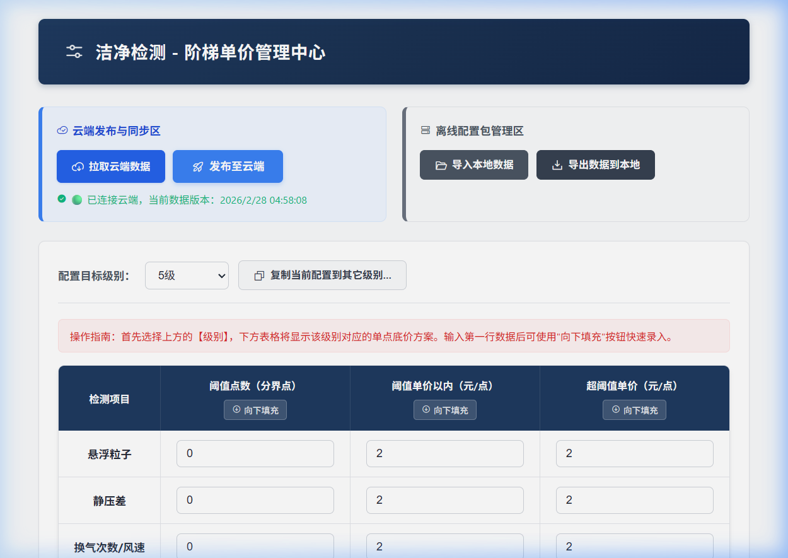
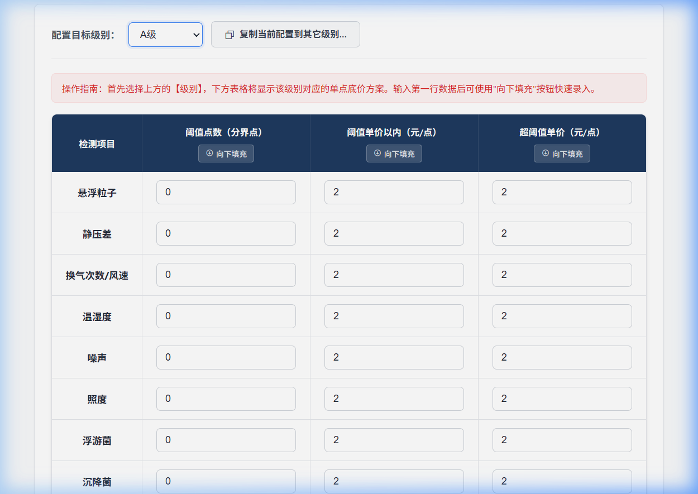
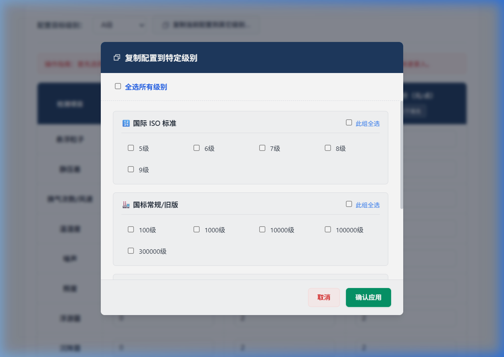
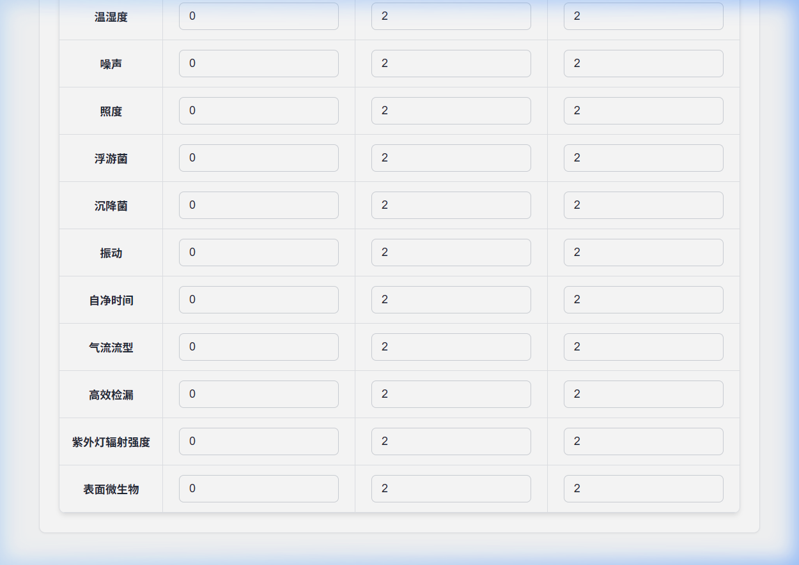

# 洁净室自动报价系统 - 管理端操作手册

欢迎使用**洁净室价格管理控制台**。此模块专供财务、技术负责人或系统管理员使用。在此处设定的每一个“检测单价”，都会作为核心计价依据被发送到云端，前台业务员（客户端）将以这些价格对客户的房间进行最终核算。

**在线地址：** [https://cleanroom1.netlify.app/admin.html](https://cleanroom1.netlify.app/admin.html)

---

## 1. 顶部控制台与安全数据流

这里显示了当前系统的核心接驳状态以及云端版本信息。

### 1.1 数据版本可视态
通过左上角的灯号，您可以确切知道目前页面上的数据是云端的还是本地未同步的：
* 🟢 **绿色**：表明已成功连接 Gitee 云端，系统当前数据与全网一致。
* 🟠 **橙色**：表明处于“离线模式”或您刚刚修改过数据还没来得及推送。全网业务员还暂时用不到您修改后的价格。

### 1.2 云端拉取重置
* **功能**：点击【从云端拉取配置覆盖本地】
* **用例**：当您换了一台电脑登录管理端（此时里面没有数据），或者想要退回撤销刚刚一通盲改的配置，点击此按钮，就能将云端稳定版强制拉取下来覆盖目前页面。

### 1.3 目标级别切换 (核心切入口)
* **功能**：“配置目标级别”下拉框。
* **用例**：报价的单价是因洁净级别而异的，您必须先在这里选择一个级别（如 `A级` 或是 `100级`），下面长条表格出现的数据，才是针对这个特定级别的定价方案。

---

## 2. 阶梯计价表配置体系

在选定级别后，页面中央的长表格负责展示并保存“阶梯价格机制”。

### 2.1 阶梯定价的三要素
为针对业务中“点数越多，单点价格越便宜”的折扣原则，系统实行三元参数定价：
* **阶梯阈值（临界点数）**：设定折扣启动点。比如设定为 10。
* **阈值内基础超点价**：如果系统算出这个测试项只需要测 3 个点（≤10），那么走这个高单价池（比如 120 元/点）。
* **超点阶梯单价（量大从优价）**：如果算出需要测 25 个点（>10），那么整个项目走这个低单价池（比如 80 元/点）。

### 2.2 自动保存与向下填充
* **修改即保存**：输入框中填入数字，不需要费力寻找保存按钮，浏览器会在 0.1 秒内做本地防丢静默暂存。
* **⬇️ 向下填充**：如果这一个级别的所有检测项目（浮游菌/沉降菌/风速等）您都打算统一价格标准，只需要配置好首行，然后点击列头部的 “向下填充” ，一键齐平！

---

## 3. 高级克隆：同级规则复制

系统有着几十种洁净级别体系。针对“同类等次收费标准一致”进行的一键下发功能。

* **功能**：点击上方【复制当前配置到其它级别...】。
* **用例**：假设您配置“1万级”费了很大劲。您希望“10万级”和“30万级”也按这个价目表收。
  1. 当前下拉框处于 “10000级”
  2. 点击复制按钮，打开该弹窗
  3. 勾选“国标常规”组下的【100000级】和【300000级】
  4. 甚至可以点击组名头部的【此组全选】
  5. 点击底部【🚀覆盖执行复制】。所有这些被选中的级别瞬间拥有了跟“1万级”一模一样的价目表！

---

## 4. 底部执行：版本发版与导出

配置完毕并复查无误后，您需要将本地的数据正式启用并分发出去。

### 4.1 全网一键公域发布
* **功能**：点击大号蓝色按钮【🚀 全网一键发布并覆写云端最新版本】。
* **效果**：浏览器在后台会自动进行 AES与 Base64级 的报文混淆封装，并提交给 `cleanroom-config` 的云端数据仓库中。
* **联动**：几秒后，公司群里所有的终端销售只要点击刷新（或是等到 5分钟后），他们界面的数据就会自动变成这套最新数据池，实现企业级的同频共振。

### 4.2 离线加密分发
* **功能**：点击黄色按钮【🔐 用混淆包导出当前所有配置保存电脑】。
* **用例**：业务员出差去了完全没有信号没有外网的西部厂区。您只需点击导出，系统会下载生成一份类似 `2026xxxx单价同步包.crm` 的文件。您把文件发给他在前台导入即可工作。该文件已被编码器打散锁定，防止业务私下篡改数字底牌。
