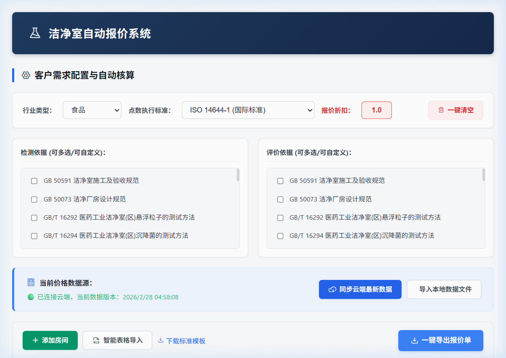
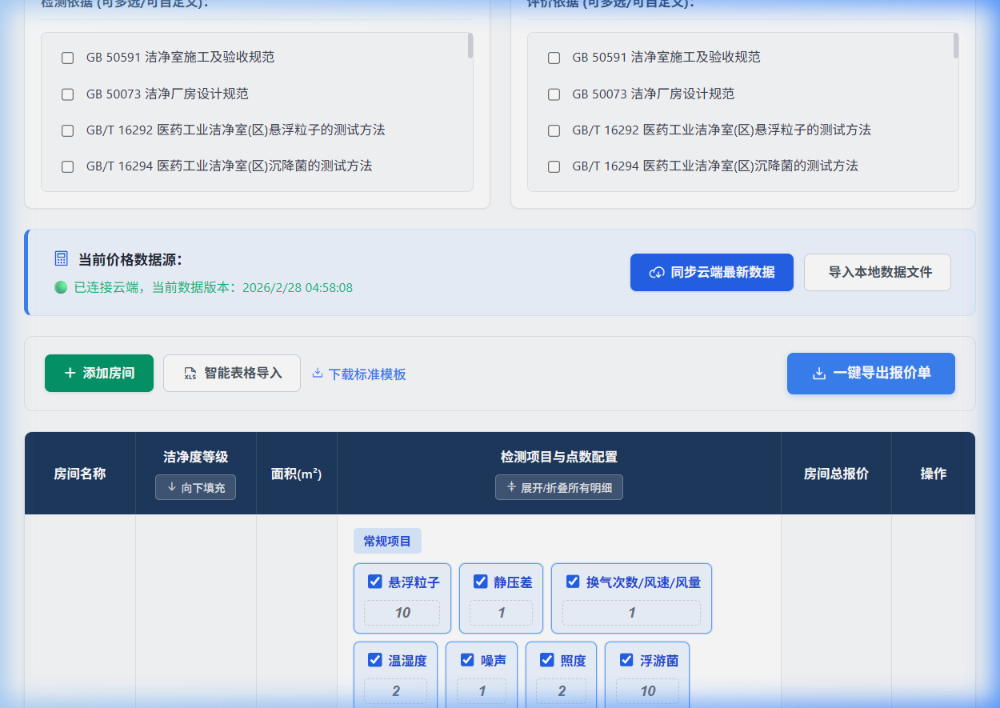
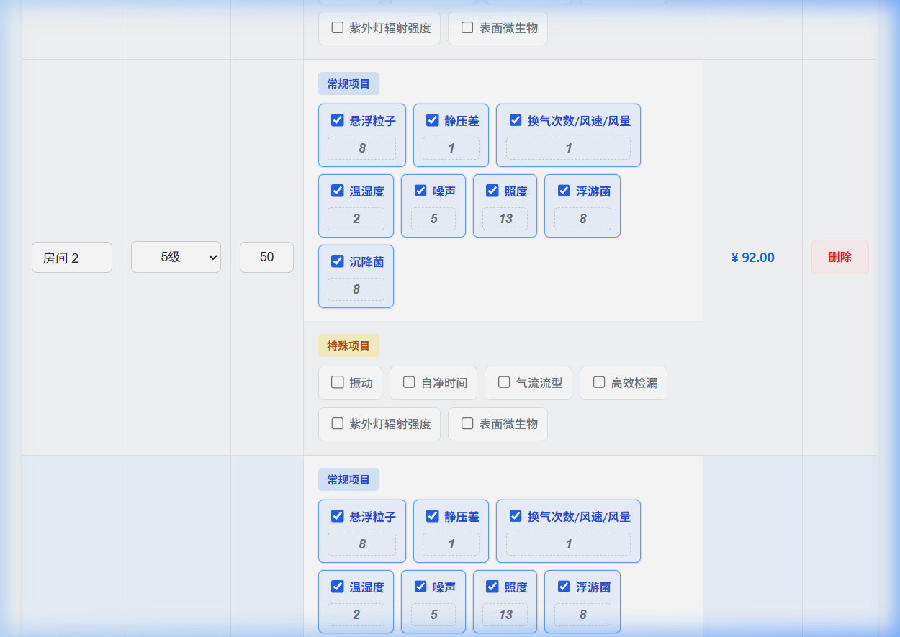
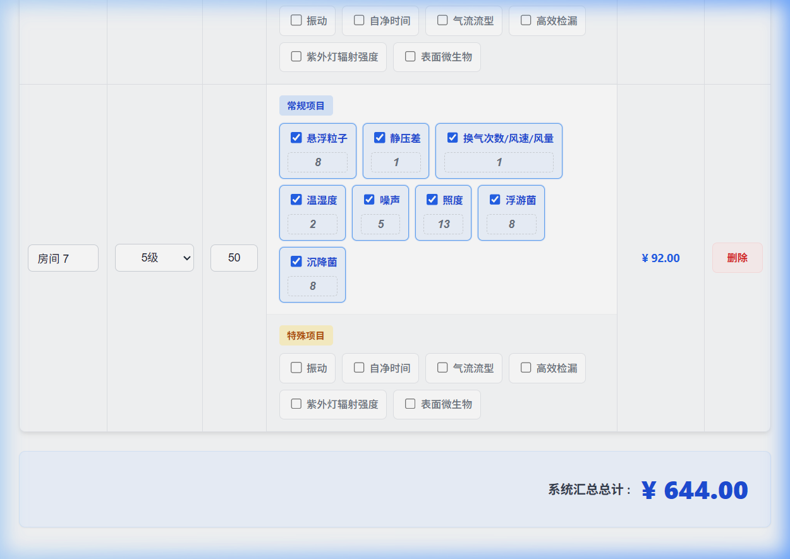

# 洁净室自动报价系统 - 客户端系统操作手册

欢迎使用**洁净室自动报价系统（客户端）**。这是面向业务开展和报价核算的核心工具面板。您可以通过此系统快速响应客户需求，完成自动化的检测点数核算及报价输出。

**在线地址：** [https://cleanroom1.netlify.app/](https://cleanroom1.netlify.app/)

---

## 1. 顶部工作区：配置需求与核心参数

当您接到新的报价需求时，最先操作的就是系统最上方的工具栏区域。

### 1.1 行业类型选择
* **说明**：系统内置了食品、药品、医院、化妆品、电子等行业选项。不同行业背后绑定的验收逻辑略有差异，您需根据客户类型正确选择。
* **用例**：客户咨询无尘车间验收，您询问得知是做化妆品的，直接在“行业类型”下拉框中选择“化妆品”即可。

### 1.2 点数执行标准切换
* **说明**：这直接决定了系统**如何根据房间面积计算检测点数**。
  - **ISO 14644-1 (国际标准)**：最通用的标准。
  - **GB 50591**：国内洁净室施工及验收规范常用标准。
  - **常规电子/工业 (GB)**：侧重工业微粒，切换后会自动隐藏微生物（浮游菌/沉降菌）等无需检测的项目。
  - **GB16292 旧版**：兼容某些老旧药厂的特殊要求。
* **用例**：客户强调“我们只要按国标50591来验收”，您便在此下拉框中选择 `GB 50591`，下方所有房间的点数会瞬间重算。

### 1.3 报价折扣系数
* **说明**：支持全局调节最终成交价。`1.0`即原价。
* **用例**：为了促成订单，你承诺给客户打九折。在这里输入 `0.9`，最下方的“系统汇总总计”会立刻乘以0.9。

### 1.4 检测依据与评价依据
* **说明**：报告上需要体现的标准大纲。系统内置了数十种常用法则。
* **用例**：勾选相应的规范即可。如果遇到生僻规范，可以勾选末尾的“自定义录入”自己打字补充。

---

## 2. 数据源监控面板

所有的计价基础单价都由后台管理员在云端统一下发。

* **状态指示**：
  - 🟢 绿色：代表当前网络畅通，成功拉取了管理员的云端最新定价，并显示了同步时间。
  - 🟠 橙色/红色：代表网络不通，当前正在使用上一次缓存的旧价格，或尚未载入任何价格。
* **用例**：如果您在没有网络的工厂里，可以通过点击【导入本地数据文件】，上传管理员私下发给您的 `.crm` 数据包，依然能正常工作。

---

## 3. 房间核算区（系统核心）

这是您打磨明细、调整点位的地方。

### 3.1 极速新增与填充
* **添加房间**：点击左上角的绿色的【➕ 添加房间】按钮。
* **连贯操作**：在面积输入框中输入完面积（如 `50`）后，直接按键盘的 **回车键(Enter)**，系统会自动新增下一行，并把光标焦点放到新房间名字框内，极其顺滑！
* **向下填充级别**：如果项目里90%都是 10万级，只需要把第一行的级别改成 `100000级`，然后点击列表头的【⬇️ 向下填充】，下面所有的房间都会变成并重算成十万级标准。

### 3.2 自动与手动点数的切换
系统是一个“自动挡+手动挡”混合引擎：
* **自动计算**：点数框默认是灰色的。当您改变面积、或者改变“执行标准”时，灰色框里的数字会智能变化。
* **人工锁定**：如果客户偏要要求悬浮粒子必须测 8 个点，您直接在此把数字改成 8。框体会变成蓝色标识这属于【强烈人工干预】。此时您再改面积或标准，这个蓝色框数字都不会改变了。
* **解除锁定**：把该蓝色框里的数字删掉变成空白，系统就会将其重新变回灰色并自动重算。

---

## 4. 汇总与输出导出

核算确认无误后，就可以进入报价收尾阶段。

### 4.1 全局总计确认
滚动到最下方，【系统汇总总计】就是折中核算后的价格结果。您可以随时调上方的“折扣系数”进行微调验证。

### 4.2 智能表格导入 (免手打大招)
* **说明**：如果客户发来了 Excel 的测点盲摸表，您完全不需要一个个手敲。
* **用例**：点击【智能表格导入】，只要客户的 Excel 里面包含“房间名称”、“级别”、“面积”等字眼的列，系统就能瞬间识别并帮你在页面上把几十个房间全建出来，并算出价格。

### 4.3 一键导出报价单
核对无误后，点击大号的【一键导出报价单】按钮。整个页面的数据会被整理成一份精美的 Excel 文件下载到您的电脑中，您可以直接发送给客户！
